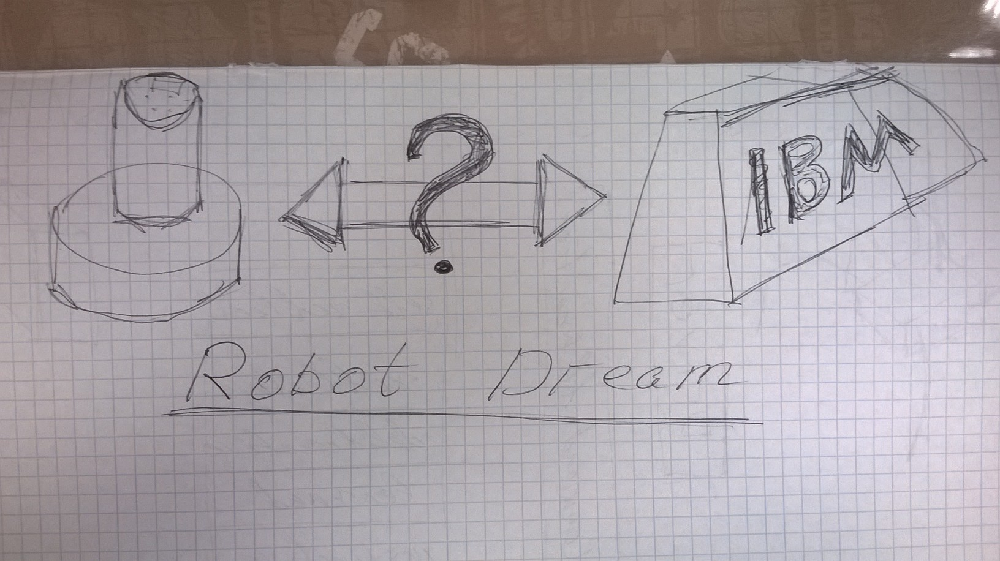
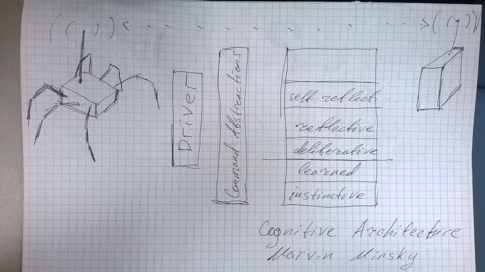

#Robot Dream architecture

##Problem

Rather than implementing the
emotional model in a computational system, we re-implemented the neurobiological 
basis of emotions using simulation [30]. This was done to create a biologically
plausible approach and to validate the results of our simulations from neurobiological 
perspective. The other way around could not provide proper evidence that
the result could be regarded as emotional phenomenon. We used the model of
basic mechanisms of a mammalian brain via neuromodulation and their mapping
to basic affective states [14, 26, 27, 28, 29]. We used the realistic spiking neural
networks with neuromodulation reconstructing all brain structures involved into
the pathways of neuromodulators of the “cube of emotions” by Hugo Lövheim
[14]. Unfortunately, current robotic systems usually do not have enough memory
and computational capacity to run realistic simulations of human brain activity.

For example, this is computational resources of rather advanced bipedal
robotic platform AR-601:

* CPU — 4th Gen Intel Core i7-4700EQ 4-Core 3.4GHz processor;
* System Memory — 1 x204-Pin DDR3L 1333MHz SO-DIMM up to 8 GB;

However the simulation of 1% of human brain required a cluster of 250 K-
supercomputers (each contains 96 computing nodes, each node contains a 2.0
GHz 8-core SPARC64 processor and 16 GB of memory) that was done by KEN
institute in 2013 and this simulation was slower than human brain in 1000 times
[12]. According to the estimates of the Human brain project the computational
capacity to simulate whole human brain should be 30 exaflop that is not feasible 
at the moment.

Therefore realistic simulation even for parts of mammalian brain involved
into neuromodulation processes leading to emotional reactions cannot be done in
real-time even at scale of rat brain (not mention human brain) on an autonomous
robotic platform. To combine autonomous control with advanced realistic emotional 
appraisal we propose life-cycle separation into “day” and “night” phases.

##Higlevel overview 

###Life cycle

Overall robotic system life-cycle is divided into two phases: wake (day) and sleep (night).

### Translation

##HLD

###Use cases

###Components

####Robot life cycle

####Sleeping brain

###Activity

---

The above diagram depicts overall organization of Robot Dream approach.
On the left it's (improvised) robotic system (like museum robot-guide)
that have to communicate with humans and need to react in (soft) real-time.
On the right there is a supercomputer (like Blue Gene) that is capable of
complex emotional appraisal and processing via simulation of spiking neural
network with neuromodulation (see NEUCOGAR project).

Robot Dream project strives to reconcile these two systems by means of
staged information exchange.

1. Robot governed by rules-based system accumulates and stores all inbound signals.
2. At some point robot "goes to sleep" and transmits stored information to supercomputer system.
3. Supercomputer starts processing of recieived information with the spiking neural network.
4. Spiking neural network produces updates to robot's rules to accommodate emotional responses.
5. Robot receives and applies updated rules the starts a new cycle.

## Application architecture

For the start we adapt our architecture for scenarios where control system
is executed on a workstation or alike and communicates with robotic platform
wirelessly over bluetooth or wi-fi.

So "closest" to a robot layer of the system is a driver that responsible for
sending the actual commands for the robot over appropriate channel
(bluetooth, wi-fi, etc.). On the other side driver interacts with the next
layer of abstract commands (hardware abstraction layer). Driver should
translate abstract commands into concrete ones for particular robotic
system.

For simplicity let's talk about "abstract commands" but we should keep in
mind that this term (and module) should include representation for sensory
signals flowing in the opposite direction: from robot to control system.
Moreover this layer might include representation for internal states of
the control system such like "feel of joy" or "bad feeling". Or just
"reward" and "punishment" signals to itself in the simplest case.

The central part of the system is a cognitive architecture implementation.
Here we adopt 6-layer architecture suggested by Marvin Minsky. For the
prototype we need to implement the first two layers, namely, instinctive
and learned.

The final layer (not depicted on the diagram) is for supercomputer (spiking
neural network) communication. It's responsible for transmission of
collected data, receipt and application of rules update.
