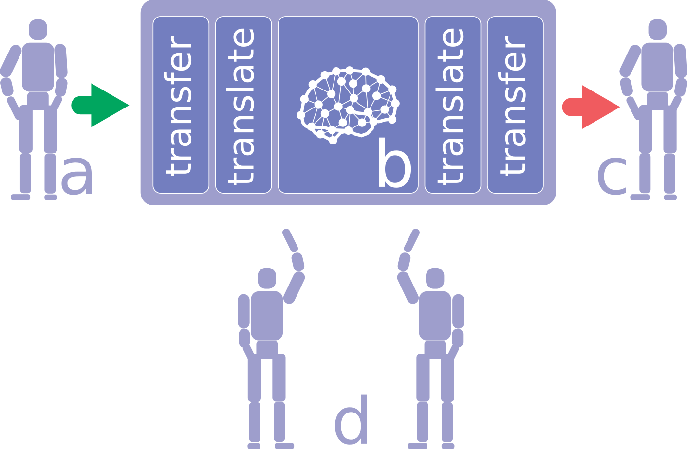

#Robot Dream architecture

##Problem

Rather than implementing the
emotional model in a computational system, we re-implemented the neurobiological 
basis of emotions using simulation [30]. This was done to create a biologically
plausible approach and to validate the results of our simulations from neurobiological 
perspective. The other way around could not provide proper evidence that
the result could be regarded as emotional phenomenon. We used the model of
basic mechanisms of a mammalian brain via neuromodulation and their mapping
to basic affective states [14, 26, 27, 28, 29]. We used the realistic spiking neural
networks with neuromodulation reconstructing all brain structures involved into
the pathways of neuromodulators of the “cube of emotions” by Hugo Lövheim
[14]. Unfortunately, current robotic systems usually do not have enough memory
and computational capacity to run realistic simulations of human brain activity.

For example, this is computational resources of rather advanced bipedal
robotic platform AR-601:

* CPU — 4th Gen Intel Core i7-4700EQ 4-Core 3.4GHz processor;
* System Memory — 1 x204-Pin DDR3L 1333MHz SO-DIMM up to 8 GB;

However the simulation of 1% of human brain required a cluster of 250 K-
supercomputers (each contains 96 computing nodes, each node contains a 2.0
GHz 8-core SPARC64 processor and 16 GB of memory) that was done by KEN
institute in 2013 and this simulation was slower than human brain in 1000 times
[12]. According to the estimates of the Human brain project the computational
capacity to simulate whole human brain should be 30 exaflop that is not feasible 
at the moment.

A realistic simulation even for parts of mammalian brain involved
into neuromodulation processes leading to emotional reactions cannot be done in
real-time even at scale of rat brain (not mention human brain) on an autonomous
robotic platform. To combine autonomous control with advanced realistic emotional 
appraisal we propose life-cycle separation into “day” and “night” phases.

##High level overview 

###Life cycle

Overall robotic system life-cycle is divided into two phases: *wake* (day) and *sleep* (night).

- [**a**] In this position a robotic system transfers the accumulated during *wake* phase experience into realistic neural network of the *sleeping brain*.
- [**b**] Processing of *sleeping phase* is done as follows:
      - The accumulated experience is transferred from a robotic system to the Sleeping brain;
      - Then simulation starts producing a set of updated rules to a robotic system;
      - Finally update is transferred to a robotic system.
x- [**c**] The updated behavior strategies is transferred to a robotic system and applied to it.
- [**d**] The robotic system continues it's wake phase with updated control system strategies, adjusted emotional reactions and accumulating new experience, storing all sensory inputs, to be processed again starting from **a**.

### Translation

The **direct translation** is done in the playback mode similar to a mammalian brain processing of the wake experience. This way whole wake experience should be translated to the sequence of sleeping brain neurons activations based on the semantics of an inbound signals, for example the activations of tactile sensors should be translated into activations of sensory cortex, audio signals should be translated into auditory cortex neurons activations. 

The **reverse translation** is gradual step by step process that could be divided into several phases:

- Increase of abstraction layer of the sleeping brain 
- Translation of rNN of the **sleeping brain** into rule based description of the behavior strategies of a robotic system
- Validation of translation steps
- Validation of overall reverse translation process
- Transfer of rule based behavior strategies into a robotic system.

Overall translation validation is based on overall statistical analysis of the semantically tagged rNN of a sleeping brain highlighting most important neuronal connections using **semantic tagging** to the key concepts.

##HLD

###Use cases

There are three main types of use cases:

1. Live
1. Translate 
   2. Direct
   2. Reverse 
   
The **living** use case is denoting the ordinary life-cycle of a robotic system or sleeping brain. For a robotic system usually consists of real time acting based on updated behavior strategies storing the daily experience with semantic highlighting: object and action tagging, pleasure and pain tagging.

The **translation** use case is denoting the transfer and processing the original stored experience of a robotic system into the form of neural network activity and from neural network into robotic system rules. The **direct** translation in the form of playback of the **wake** phase experience in form of neuronal activity of a sleeping brain, the **reverse** process the updated rNN of a sleeping brain in to rules of a robotic system.

###Components

####Robot life cycle

This is high-level representation of the overall structure of the robotic system. The **RobotLifeCycle** component provides proper functions for the real-time operations of a robotic system including storage of the **wake** phase experience with semantic tagging and translation into the **sleeping brain**.

... Rewrite the paragraphs below

So "closest" to a robot layer of the system is a **driver** that responsible for
sending the actual commands for the robot over appropriate channel
(bluetooth, wi-fi, etc.). On the other side driver interacts with the next
layer of abstract commands (hardware abstraction layer). Driver should
translate abstract commands into concrete ones for particular robotic
system.

"Abstract commands" we should keep in mind that this term (and module) 
should include representation for sensory
signals flowing in the opposite direction: from robot to control system.
Moreover this layer might include representation for internal states of
the control system like "pleasure" and "pain", or just "reward" and "punishment".

The central part of the system is a cognitive architecture implementation.
Here we adopt "model of six" proposed by Marvin Minsky. 
For the prototype we need to implement the first two layers, namely, instinctive
and learned.

#####Semantic tagging

Semantic tagging is the association process of several sensory inputs channels using temporal window.
A robotic system tags time frames, and if possible objects in different input channels based on detected tagging events building associations in a forms of semantic clustering. Tagging events could be:

- pleasure and pain stimulus 
- detected visual object: banana, battery, bright flash, human figure, etc
- detected audio signal: loud sound, word, etc
- sensory stimulus

Different sensory tagged are translated into tagged neuronal structures of the rNN of the sleeping brain during the direct translation phase.

... Add activity diagram here

#####Direct translation

Transfer of the stream of stored and tagged experience from the robotic system into sleeping brain.

#####Rule based system

The temporal probabilistic rules system.

...

####Sleeping brain

The high-level representation of overall structure of the **sleeping brain**. 

The robotic system **ExperienceTranslator** includes **ExperiencePlayer** that translates different types of tagged inbound sensory inputs transferred from robotic system into neuronal activities of rNN of the sleeping brain in the form of synchronous playback of neuronal activations based on wiring of sensory channel to the sleeping brain area.

The **ReverseTranslator** component is responsible for the translation of neuronal structures and activities or the sleeping brain into the robotic system rule based system. The translation process could be divided into two principal phases:

- rising abstraction layer or the rNN of the sleeping brain reducing computational load making rNN operate in sub-real-time mode
- generalization and convolution neuronal structures into rules of the robotic system via **GeneralisationStrategy**
- generalization and convolution are gradual stepwise processes that include 2 types of validation: step **StepValidator** and overall **OverallValidator**. Where the **OverallValidator** does validation based on number of neuronal connections to the pattern tagged with one event. The threshold value of the connection could be set as for example 20 percent per step and 60 percent per overall process (this should be clarified). 

#####Rise of abstraction layer of the rNN of sleeping brain

#####Narrative

The stable sequence of the neuronal patterns/circuits invocations could be generalized in one high-level construct of the temporal probabilistic rules system.

...

#####Fusion

...

#####Neuronal structures tagging

Every time the robotic system perceives tagged event including new object the inbound sensory stream is been tagged as well as neuronal structures of sleeping brain, during the **direct translation** that are involved in the processing are tagged as related to the tagged event. At the end of the day the rNN is semantically marked neuronal pattern and circuits. 

#####Pleasure and pain 

...

#####Validation 

During the **reverse translation** phase these pattern and circuits are generalized into high-level logical rules via mechanisms described above. 
The number of representations of objects is reduced, but the transnational system should track the adequacy of processing via selecting most important according to the number of tagged connections events(objects) and persist them for further processing. If a important object was deleted during processing the system start the processing stage from the begging using less strict generalization rules.

###Activity

