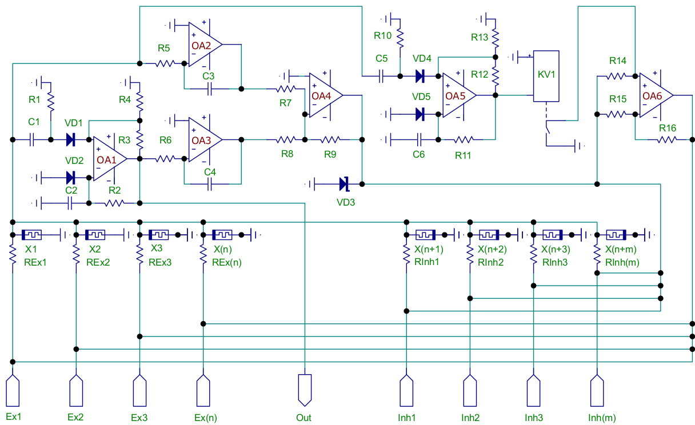

# Memristive brain architecture

Starting idea of the memristive brain project: implement emotional pathways of a mammalian brain biomimetically  reproducing cortical and subcortical structures of a mammalian brain. Previously we have used "cube of emotions" by Hugo Lövheim to as the base for the emotional simulation for the reimplementation of psycho-emotional states of a mammal in a computational system, see our project [NeuCogAr](https://github.com/research-team/NEUCOGAR). The "cube of emotions" is based on three monoamine neuromodulators: dopamine (DA), noradrenaline (NA) and serotonin (5HT).

## Component diagram

As the part of [Robot Dream architecture](architecture.md) the memristive brain component takes central role in a robotic system, for exhaustive description of other than memristive brain components see [architectural documentation](architecture.md) 

## Initial ideas

The initial idea was to start with dopaminergic pathways of mammals, for example nigrostriatal pathway as possibly most basic and simplest pathway among others of DA, NA and 5HT pathways. 

This pathway works in balance of excitation/inhibition as well there is influence of the dopamine neuromodulation over striatal D1 and D2 receptors.

This is implemented dopamine pathways in the [NeuCogAr project](https://github.com/research-team/NEUCOGAR).

## Initial requirements

The memristive solution should be capable of key processes of a mammalian brain involved in psycho-emotional processing:

1. Excitatory 
1. Inhibitory 
1. Neuromodulatory 

## Memristive neuron

As the starting point we have selected the implementation of inhibitory impact over neuronal processes in memristive hardware implementation. 

The figure above represents a high level block diagram of artificial memristive neuron and contains inputs as green circles 1, ..n, ..n + m, where n is the number of excitatory synapses and m is number of inhibitory synapses per one cell. 
The scale of the n+m is 10^4. 

Excitatory and inhibitory memristive elements are depicted with pink and blue color rectangles and are marked as Ex and Inh respectively. 
Excitatory memristive elements are trained via Hebbian learning while inhibitory memristive elements are trained to via one of the inhibitory learning functions "sombrero". 

All excitatory and inhibitory memristive element outputs are transferred to threshold adder and integrator 2. The adder implements balancing of excitatory and inhibitory impact of memristive elements (synapses), and its output starts the output pulse (spike) generator. 

The integrator 1 represents integrated output of the neuron and its output is processed by inverting adder to be compared with integrated input of the neuron provided via integrator 1. The inverting adder output is transmitted to inhibitory memristive elements and implements "sombrero" shaped learning function (the blue rectangular graph). 

The monostable multivibrator is activated via positive signal of the inverting adder triggering a relay that grounds the slave inverter crating the positive half of the Δt axis of the learning function graph (show as right half of the pink rectangular graph). 

The negative (left) half of the graph is formed via the slave inverter in the non-grounded mode. The output of the feedback: 1/x or Hebbian learning is provided to all excitatory memristive elements.

The proposed schema implements two possible algorithms of learning or STDP for excitatory and inhibitory memristive elements along with “integrate and fire” algorithm of output spikes generation.

## Wiring schematic

The Figure above represents the wiring diagram, where excitatory and inhibitory pulses are transmitted to memristive elements Xj, where j=1..n+m. When the accumulated voltage on the memristive elements exceeds the threshold, the one short multivibrator on the operational amplifier OA1 provides a single short pulse, which duration is determined by T1 = C2R2ln(1 +R3/R4). Signals from Out and OA1 output are transmitted to integrators on op-amps OA2 and OA3, that set the impulse descending edge of the training function. The pulse-rise time constant of the integrating circuit is t = R5 * C3 = R6 * C4. Output signals from integrators are transmitted to the inverting adder on op-amp OA4. The output signal (the turned upside down bell) is applied to inhibitory Inh memristive elements. The monostable multivibrator on the op-amp OA4 is triggered by a positive pulse of the signal Out. The
pulse duration is determined by the circuit elements via: T2 = C6 R11 ln(1 + R12/R13) and equals T1. Output positive pulse is applied to the key KV1 (implemented via a relay), that controls a state of not inverting input of the controlled inverter of op-amp OA6. We used the electromechanical relay instead of transistor key for descriptive reasons. When the non-inverting input of the operational amplifier on op-amp OA6 is shorted to the ground, the operational amplifier works as an
inverter; otherwise, it acts as a normal amplifier of the signal from inverting adder op-amp OA4. From the output of op-amp OA6 the signal is transmitted to excitatory memristive elements Exi, where i=1..n.

## Neuromodulation

We plan to implement the [G-Protein](https://en.wikipedia.org/wiki/G_protein%E2%80%93coupled_receptor) signalling [pathway principles](https://en.wikipedia.org/wiki/Signal_transduction) in hardware based on memristive elements. 

