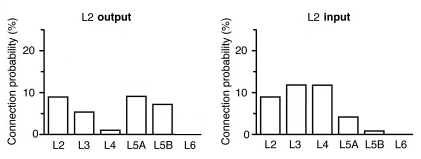
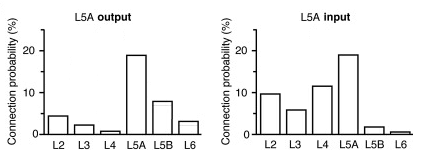
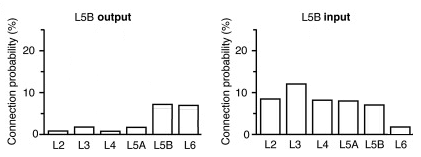
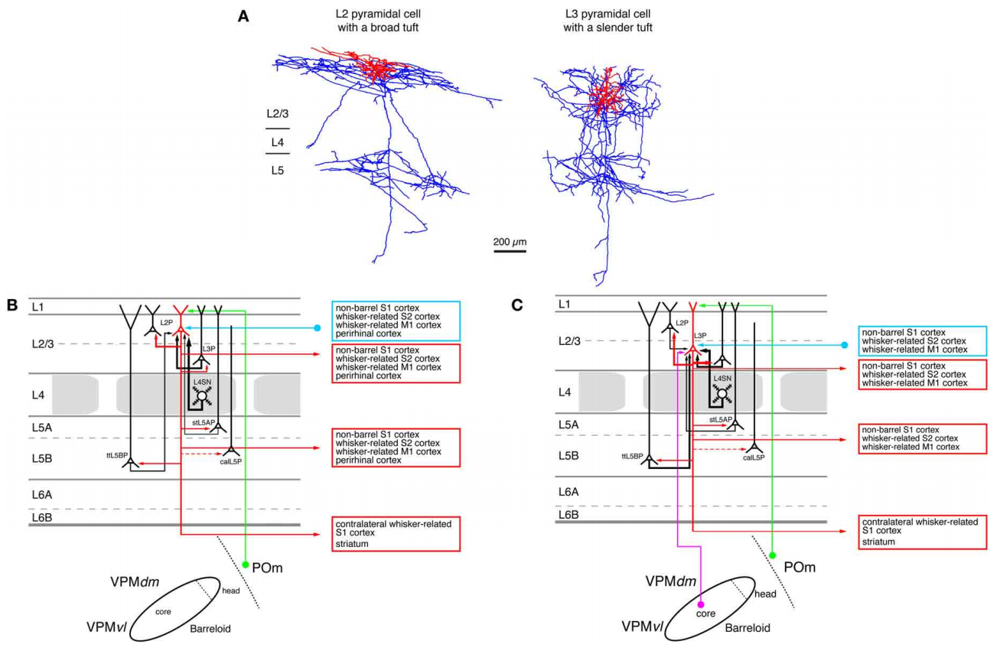
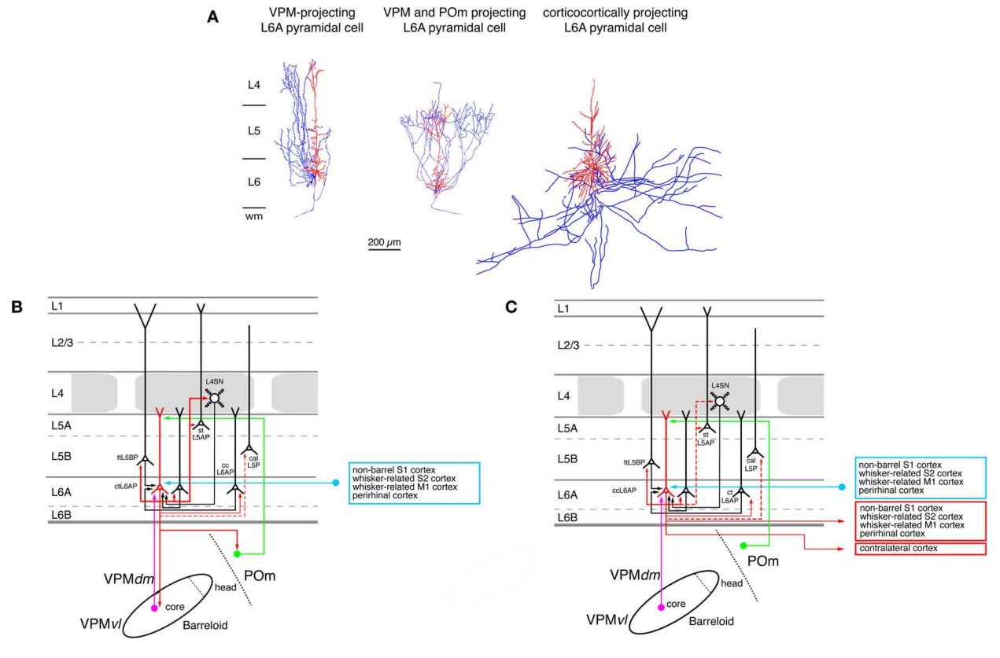
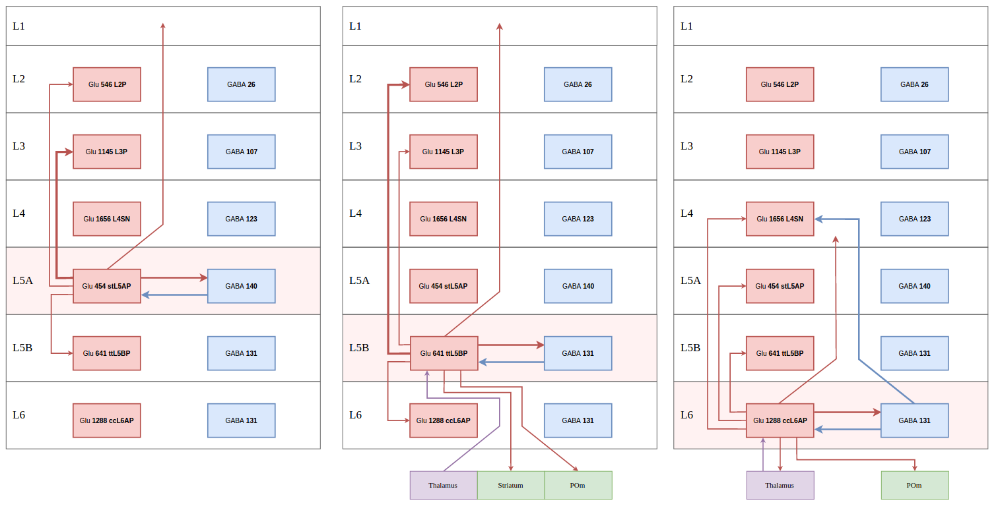

# Review of somatosensory cortex (Mouse and rat brains)

Neocortical areas are believed to be organized into vertical modules, the cortical columns, and the horizontal layers 1–6. In the somatosensory barrel cortex these columns are defined by the readily discernible barrel structure in layer 4. Information processing in the neocortex occurs along vertical and horizontal axes, thereby linking individual barrel-related columns via axons running through the different cortical layers of the barrel cortex. Long-range signaling occurs within the neocortical layers but also through axons projecting through the white matter to other neocortical areas and subcortical brain regions. Because of the ease of identification of barrel-related columns, the rodent barrel cortex has become a prototypical system to study the interactions between different neuronal connections within a sensory cortical area and between this area and other cortical as well subcortical regions. Such interactions will be described specifically for the feed-forward and feedback loops between the somatosensory and the somatomotor cortices as well as the different thalamic nuclei. In addition, recent advances concerning the morphological characteristics of excitatory neurons and their impact on the synaptic connectivity patterns and signaling properties of neuronal microcircuits in the whisker-related somatosensory cortex will be reviewed. In this context, their relationship between the structural properties of barrel-related columns and their function as a module in vertical synaptic signaling in the whisker-related cortical areas will be described.

- [Cortical layers of barrel column (Mouse)](#cortical-layers-of-barrel-column-mouse)
- [Neuron](#neuron)
- [Parameters](#parameters)
- [Number of neurons per column (Mouse)](#number-of-neurons-per-column-mouse)
- [Excitatory connection probability (Mouse)](#excitatory-connection-probability-mouse)
- [Strength inputs in L2/3 (Mouse)](#strength-inputs-mouse)
- [Kinetics of uEPSPs (Mouse)](#kinetics-of-uepsps-uncaging-evoked-excitatory-postsynaptic-potentials-mouse)
- [Connections](#connections)
	- [Glutamate (Rat)](#glutamate-rat)
		- [Layer 4](#layer-4)
		- [Layers 2/3](#layers-23)
		- [Layers 5A/5B](#layers-5a5b)
		- [Layers 6A/6B](#layers-6a6b)
	- [GABA](#gaba)
- [Final schema](#final-schema)
- [References](#references)

## Cortical layers of barrel column (Mouse)

> Examples of different dendritic morphologies found in the mouse C2 barrel column. Layer boundaries are drawn to scale at their mean subpial distance 

**[Link #1]**

## Neuron

<table>
	<tr align="center">
		<td><b>Neuron name</b> <td><b>NEST model</b> <td><b>Proxy NEST model</b> <td><b>Standard NEST parameters</b> <td><b>Value</b> <td><b>Description</b>
	</tr>
	<tr>
		<td rowspan="14"><b>pyramidal cell</b>
		<td rowspan="14">Doesn't exist
		<td rowspan="14">iaf_psc_exp <b>1</b>
		<td>V_reset
		<td>-70.0
		<td>Reset membrane potential after a spike in mV
	</tr>
	<tr>
		<td>V_th
		<td>-55.0
		<td>Spike threshold in mV
	</tr>
	<tr>
		<td>tau_m
		<td>10.0
		<td>Membrane time constant in ms
	</tr>
	<tr>
		<td>I_e
		<td>0.0
		<td>Constant input current in pA
	</tr><tr>
		<td>t_spike	
		<td>-1.0	
		<td>Point in time of last spike in ms
	</tr><tr>
		<td>V_m
		<td>-70.0
		<td>Membrane potential in mV
	</tr><tr>
		<td>E_L
		<td>-70.0
		<td>Resting membrane potential in mV
	</tr><tr>
		<td>tau_syn_ex
		<td>2.0
		<td>Time constant of postsynaptic excitatory currents in ms
	</tr><tr>
		<td>beta_Ca
		<td>0.001
		<td>?? Not declared in NEST documentation
	</tr><tr>
		<td>t_ref
		<td>2.0
		<td>Duration of refractory period (V_m = V_reset) in ms
	</tr><tr>
		<td>Ca
		<td>0.0
		<td>?? Not declared in NEST documentation
	</tr><tr>
		<td>C_m
		<td>250.0
		<td>Capacity of the membrane in pF
	</tr>
	<tr>
		<td>tau_syn_in
		<td>2.0
		<td>Time constant of postsynaptic inhibitory currents in ms
	</tr>
	<tr>
		<td>tau_Ca
		<td>10000.0	
		<td>?? Not declared in NEST documentation
	</tr>
</table>

> <b>1</b> "We found that the empirical dynamic I-V curve could be accurately fitted by the **exponential integrate-fire (EIF)** form Eq (2) for each of the four pyramidal-cell classes from layers 2/3, 4 and 5" (in chapter "Quality of model fits")  
**[Link #7]**

## Parameters

#### The mean μ and standard deviation σ for the parameter distributions (log-normal unless otherwise marked).
'*' is Normal distribution.	

<table>
	<tr align="center">
		<td><b>Parameter</b> <td><b>Description</b> <td colspan="2"><b>Layer 2/3</b>  pyramidal-cell <td colspan="2"><b>Layer 4</b>  pyramidal-cell  <td colspan="2"><b>Layer 5</b>  slender-tufted pyramidal cells <td colspan="2"><b>Layer 5</b>  thick-tufted pyramidal cells
	</tr>
	<tr>
		<td>	<td>	<td>μ	<td>σ	<td>μ	<td>σ	<td>μ	<td>σ	<td>μ	<td>σ
	</tr>
	<tr>
		<td>C (pF)	<td>Membrane capacitance <td>134	<td>32.8 <td>135 <td>36.7 <td>133 <td>31.9 <td>284 <td>78.5
	</tr>
	<tr>
		<td>Rin(MΩ) <td>Input Resistance <td>121 <td>45.2 <td>149 <td>50.5 <td>154 <td>73.3 <td>52.4 <td>19.4
	</tr>
	<tr>
		<td>Gin(nS) <td>Input conductance <td>9.31 <td>3.24 <td>7.52 <td>2.69 <td>7.94 <td>3.38 <td>21.5 <td>7.4
	</tr>
	<tr>
		<td>τ (ms) <td>Membrane time constant <td>14.6 <td>2.53 <td>17.2 <td>4.18 <td>18.3 <td>4.74 <td>18.7 <td>4.23
	</tr>
	<tr>
		<td>E (mV) <td>Membrane equilibrium potential <td>−79.3* <td>4.27* <td>−71.8* <td>4.20* <td>−69.9* <td>4.18* <td>−68.5* <td>3.98*
	</tr>
	<tr>
		<td>S(%) <td>Sag percentage from hyperpolarising current <td>11 <td>5.7 <td>21 <td>7.65 <td>26.8* <td>7.58* <td>30.6* <td>9.20*
	</tr>	
	<tr>
		<td>VT − E (mV) <td>Potential between threshold and rest <td>29.8 <td>4.16 <td>23.2 <td>4.46 <td>20.1 <td>4.28 <td>15.7 <td>4.25
	</tr>
	<tr>
		<td>VT (mV) <td>Spike-onset threshold <td>−49.5* <td>3.81* <td>−48.7* <td>3.53* <td>−49.7* <td>3.56* <td>−52.7* <td>3.59*
	</tr>
	<tr>
		<td>Ispike (pA) <td>Spike initiation current <td>270 <td>77.4 <td>173 <td>66.5 <td>150 <td>48.6 <td>324 <td>105
	</tr>
	<tr>										
		<td>ΔT (mV) <td>Spike sharpness <td>1.34 <td>0.55 <td>1.28 <td>0.394 <td>1.35 <td>0.523 <td>1.16 <td>0.479
	</tr>
	<tr>
		<td>Aamp (mV) <td>Action potential amplitude <td>75.5* <td>7.76* <td>74.5* <td>6.47* <td>77.2* <td>7.07* <td>84.1* <td>5.15*
	</tr>
	<tr>
		<td>Adur (ms) <td>Action potential duration <td>1.41 <td>0.245 <td>1.33 <td>0.215 <td>1.16 <td>0.271 <td>0.981 <td>0.149
	</tr>
	<tr>
		<td>Arise (mV/ms) <td>Action potential rate of rise <td>234 <td>50.3 <td>258 <td>46.2 <td>275 <td>76.8 <td>319 <td>46.9
	</tr>
	<tr>
		<td>g 1 (nS) <td>Post-spike jump in conductance <td>14.3 <td>7.5 <td>20 <td>9.6 <td>15.7 <td>7.7 <td>26.1 <td>12.5
	</tr>
	<tr>
		<td>τg (ms) <td>Conductance decay time constant <td>17 <td>17.4 <td>17.3 <td>15.8 <td>23.3 <td>23.9 <td>24.5 <td>21.8
	</tr>
	<tr>
		<td>VT1 (mV) <td>Post-spike jump in spike threshold <td>16.2 <td>4.4 <td>15.9 <td>5.1 <td>13.1 <td>4 <td>14.8 <td>4.4
	</tr>
	<tr>
		<td>τT (ms) <td>Spike threshold decay time constant <td>13.6 <td>8.9 <td>14.1 <td>4.9 <td>16.4 <td>9.7 <td>12.7 <td>5.3
	</tr>
	<tr>
		<td>Ejump (mV) <td>Post-Spike jump in E <td>15.8 <td>5.7 <td>10.1 <td>3.7 <td>9.6 <td>4.3 <td>7.9 <td>4.6		
	</tr>
	<tr>
		<td>Esag (mV)	<td>Post-spike sag in E <td>1.3 <td>0.9 <td>1.8 <td>1.1 <td>2.7 <td>1.7 <td>4.4 <td>2		
	</tr>
	<tr>
		<td>tsag (ms) <td>Post-spike time of Esag <td>87.5 <td>23.2 <td>66.2 <td>18.9 <td>53 <td>19.9 <td>40.4 <td>11.5		
	</tr>
	<tr>
		<td>t0 (ms) <td>Post-spike time at which E crosses baseline <td>45.9 <td>15.7 <td>30.6 <td>12.2 <td>21.6 <td>12 <td>11.5 <td>6.8
	</tr>
</table>

**[Link #7]**

## Number of neurons per column (Mouse)
<table>
	<tr align="center">
		<td><b>Layer</b>
		<td><b>Glu</b>
		<td><b>GABA</b>
		<td rowspan="7">
	</tr>
	<tr>
		<td align=right><b>L2</b>
		<td>546 ± 49
		<td>107 ± 7
	</tr>
	<tr>
		<td align=right><b>L3</b>
		<td>1145 ± 132
		<td>123 ± 19
	</tr>
	<tr>
		<td align=right><b>L4</b>
		<td>1656 ± 83
		<td>140 ± 9
	</tr>
	<tr>
		<td align=right><b>L5A</b>
		<td>454 ± 46
		<td>90 ± 14
	</tr>
	<tr>
		<td align=right><b>L5B</b>
		<td>641 ± 50
		<td>131 ± 6
	</tr>
	<tr>
		<td align=right><b>L6</b>
		<td>1288 ± 84
		<td>127 ± 9
	</tr>
</table>

> Estimated numbers (mean ± SEM) of excitatory and inhibitory cells in different layers of the mouse C2 barrel column 

**[Link #1]**

## Excitatory connection probability (Mouse)
<table>
	<tr align=center>
		<td> %
    	<td><b>→ L2</b>
    	<td><b>→ L3</b>
    	<td><b>→ L4</b>
    	<td><b>→ L5a</b>
    	<td><b>→ L5b</b>
    	<td><b>→ L6</b>
	</tr>
	<tr>
		<td align=right><b>L2 →</b><td>9.3  <td>12.1 <td>12.0 <td>4.3  <td>0.96 <td>0
	</tr>
 	<tr>
		<td align=right><b>L3 →</b><td>5.5  <td>18.7 <td>14.5 <td>2.2  <td>1.8  <td>0
 	</tr>
	<tr>
		<td align=right><b>L4 →</b><td>0.96 <td>2.4  <td>24.3 <td>0.7  <td>0.7  <td>0
	</tr>
	<tr>
		<td align=right><b>L5a →</b><td>9.5  <td>5.7  <td>11.6 <td>19.1 <td>1.7  <td>0.6
 	</tr>
	<tr>
		<td align=right><b>L5b →</b><td>8.3  <td>12.2 <td>8.1  <td>8.0  <td>7.2  <td>2
 	</tr>
	<tr>
		<td align=right><b>L6 →</b><td>0    <td>0    <td>3.2  <td>3.2  <td>7.0  <td>2.8
	</tr>
</table>
> The layer-specific mean input and output connectivity from L2, L3, L4, L5A, L5B and L6 

**[Link #1]**

**[Link #1]**

## Strength inputs (Mouse)
Summary of excitatory and inhibitory input patterns across all the cell types examined.  
Data in table is presented for **pyramidal neuron**, because it's the main type of cells in barrel columns.
<table>
	<tr align="center">
		<td><b>Layer</b>
		<td><b>Excitatory (%)</b>
		<td><b>Inhibitory (%)</b>
		<td rowspan="8" width="50%">
		Excitatory
		
		 
		Inhibitory
		
	</tr>
	<tr>
		<td align=right><b>L1</b><td>0<td>35
	</tr>
	<tr>
		<td align=right><b>L2/3</b><td>28<td>44
	</tr>
	<tr>
		<td align=right><b>L4</b><td>34<td>5
	</tr>
	<tr>
		<td align=right><b>L5A</b><td>25<td>3
	</tr>
	<tr>
		<td align=right><b>L5B</b><td>8<td>4
	</tr>
	<tr>
		<td align=right><b>L6</b><td>5<td>9
	</tr>
	<tr>
		<td colspan="3">
			<ul>
				<li><b>BS</b> Burst spiking cells
				<li><b>MC+</b> SOM+/CR+ Martinotti cells
				<li><b>MC-</b> SOM+/CR- Martinotti cells
				<li><b>FS</b> Basket cells
				<li><b>BC</b> Bipolar cells
				<li><b>PY</b> Pyramidal cells
				<li><b>Chand</b> Chandelier cells
				<li><b>NG</b> Neurogliaform cells
				<li><b>RS</b> Regular Spiking Inhibitory Neurons
				<li><b>IS</b> Irregular Spiking Inhibitory Neurons
			</ul>
	</tr>
</table>

**[Link #5]**

## Kinetics of uEPSPs (uncaging-Evoked Excitatory PostSynaptic Potentials) (Mouse)

>(A) **Latency** was measured from AP peak to uEPSP onset.  
**Rise-time** was measured from 20% to 80% of the peak uEPSP amplitude.  
Time-to-peak was measured from latency to peak  
**Half-width** indicates the measured full-width at half-maximal response amplitude.  
Decay-time was the time constant obtained from a single exponential fit of 80% to 20% on the falling phase of the uEPSP.  
(B) Example experiments showing differences in uEPSP duration. An example synaptic connection between two L4 neurons (red) has a longer duration compared to a different example experiment with a synaptic connnection from a L4 neuron to a L3 neuron (blue). The traces have been scaled so that the peak of the uEPSP has the same amplitude.  
(C) Example experiments showing differences in uEPSP latency. An example synaptic connection between two L2 neurons (red) has a shorter latency than a different example experiment showing a connection from L2 to L5B (blue). The traces have been scaled so that the peak of the uEPSP has the same amplitude.  
(D) Color-coded matrix of layer specific uEPSP latencies.  
(E) Color-coded matrix of layer specific uEPSP rise-times.  
(F) Color-coded matrix of layer specific uEPSP half-widths 

**[Link #4]**

### Full table of uncaging-Evoked Excitatory PostSynaptic Potentials:

**[Link #4]**

## Connections

### Glutamate (Rat)

### Layer 4
<table>
	<tr>
		<td width="40%"></td>
		<td align="justify">
			
<b>Excitatory synaptic input–output relationship in layer 4 of the S1 barrel cortex</b>
			
(A) Reconstructions of a L4 spiny stellate cell (left) and a L4 star pyramidal neuron (right) in rat barrel cortex. Modified with permission of John Wiley and Sons on behalf of ThePhysiological Society.  
			
(B) Diagram of the excitatory synaptic connections of and onto L4 spiny neurons (red neuron with blue axon) in the barrel cortex. Although layer 4 contains both spiny stellate and star pyramidal neurons and a few pyramidal cells only spiny stellate cells are shown for simplicity. Note that L4 spiny neurons provide synaptic output to virtually all layers in a barrel column. For detailed information on the location of synaptic contacts and differences in the connectivity of the three different excitatory L4 neurons see text. The thalamic region is represented by a single barreloid in the VPM nucleus of the thalamus; the VPM/POm border is marked by a dashed line.    

			
<b>Red neuron</b>: Dendrites and axon of the neuron for which the input–output relationship is described in this figure. Different cortical layers as indicated on the left. The thickness of the red arrows pointing to a postsynaptic (black) neurons indicates the connection probability between this and the black neurons as well as cortical and subcortical areas. The dashed red arrow in layer 5 marks a likely but not yet verified synaptic connection onto a corticocallosal L5 pyramidal cell. 
			  <b>Black neurons</b>: Dendrites and axon of neurons sending to and receiving synaptic input from to the red neuron. The thickness of the black arrows pointing to the red neuron indicates the connection probability between these neurons and the red neuron.

			
<b>Light blue arrows</b>: Excitatory synaptic input from cortical regions outside the S1 barrel cortex.
			  <b>Magenta arrow</b>: Synaptic input from the VPM (lemniscal pathway).
			  <b>Green arrow</b>: Synaptic input from the POm (paralemniscal pathway). However, for L4 spiny neurons synaptic input from outside the barrel cortex originates almost exclusively from the core of the barreloid in the dorsomedial part of the VPM. 

			
Abbreviations:
			<ul>
				<li>VPM, ventroposterior medial nucleus of the thalamus;
				<li>dm, dorsomedial part;
				<li>vl, ventrolateral part; 
				<li>POm, posterior medial nucleus of the thalamus; 
				<li>L2P, L2 pyramidal cell; 
				<li>L3P, L3 pyramidal cell; 
				<li>L4SN, L4 spiny neuron;  
				<li>stL5P, slender-tufted L5A pyramidal cell;
				<li>ttL5BP, thick-tufted L5B pyramidal cell;  
				<li>calL5P, corticocallosal L5 pyramidal cell; 
				<li>ccL6AP, corticocortical L6A pyramidal cell; 
				<li>ctL6AP, corticothalamic L6A pyramidal cell.
			</ul>
		</td>
	</tr>
</table>

**[Link #5]**

---

### Layers 2/3

> **Excitatory synaptic input–output relationship in layer 2/3 of the S1 barrel cortex**  
(A) Reconstructions of a pyramidal cell located in the upper half of layer 2/3 (L2 pyramidal cell, left) and a pyramidal cell located in the lower half of layer 2/3 (L3 pyramidal cell, left) of rat barrel cortex; modified with permission of the Society of Neuroscience. Note that the apical tuft of the L2 pyramidal cell is substantially larger than the basal dendritic tree of that neuron while L3 pyramidal cells have slender apical tufts. Modified with permission from the Society of Neuroscience.  
(B) Diagram of the excitatory synaptic connections of and onto L2 pyramidal cells (red neuron with blue axon) in the barrel cortex. Only synaptic input from neurons and regions relevant for L2 pyramidal cells is shown in this graph. For detailed information on the location of synaptic contacts and possible subtypes of L2 pyramidal cells see text.  
(C) Diagram of the excitatory synaptic connections of and onto L3 pyramidal cells (red neuron with blue axon) in the barrel cortex. Only synaptic input from neurons and regions relevant for L3 pyramidal cells is shown in this graph. For detailed information on the location of synaptic contacts and possible subtypes of L3 pyramidal cells see text.

**[Link #5]**

---

### Layers 5A/5B

> **Excitatory synaptic input–output relationship in layer 5 of the S1 barrel cortex**  
(A) Reconstructions of three types of pyramidal cells in layer 5 of the barrel cortex. Slender-tufted pyramidal cells (left) are predominantly located in sublamina 5A while thick-tufted pyramidal cells (middle) are mostly found in sublamina 5B. Corticocallosal L5 pyramidal cells (right) are found throughout layer 5. They are characterized by a very diminutive or even absent apical tuft. Modified with permission of the Society of Neuroscience, Springer and Oxford Journals, respectively.  
(B) Diagram of the excitatory synaptic connections of and onto slender-tufted L5A pyramidal cells (red neuron with blue axon) in the barrel cortex. Only synaptic input from neurons and regions relevant for slender-tufted L5A pyramidal cells is shown in this graph. For detailed information on the location of synaptic contacts and possible subtypes of slender-tufted L5A pyramidal cells see text.  
(C) Diagram of the excitatory synaptic connections of and onto thick-tufted L5B pyramidal cells (red neuron with blue axon) in the barrel cortex. Only synaptic input from neurons and regions relevant for thick-tufted L5B pyramidal cells is shown in this graph. Note that thick-tufted L5B pyramidal cells receive synaptic input from virtually all cortical layers. For detailed information on the location of synaptic contacts and possible subtypes of thick-tufted L5B pyramidal cells see text.

**[Link #5]**

---

### Layers 6A/6B

> **Excitatory synaptic input–output relationship in layer 6 of the S1 barrel cortex**  
(A) Reconstructions of three types of pyramidal cells in sublamina A of layer 6 in the rat barrel cortex; modiefied with permission of the Society for Neuroscience. L6A pyramidal cell projecting exclusively back to the VPM nucleus of the thalamus (left), L6A pyramidal neuron projecting to both the VPM and the POm nuclei of the somatosensory thalamus (middle) and a corticocortical L6A pyramidal cell. The apical trees of L6A pyramidal cells terminate between upper layer 5 and lower layer 3 and have very small or even no tuft. Modified with permission from the Society for Neuroscience.  
(B) Diagram of the excitatory synaptic connections of and onto corticothalamic L6A pyramidal cells (red neuron with blue axon) in the barrel cortex. Only synaptic input from neurons and regions relevant for corticothalamic L6A pyramidal cells is shown in this graph. For detailed information on the location of synaptic contacts and possible subtypes of corticothalamic L6A pyramidal cells see text.  
(C) Diagram of the excitatory synaptic connections of and onto corticocortical L6A pyramidal cells (red neuron with blue axon) in the barrel cortex. Only synaptic input from neurons and regions relevant for corticocortical L6A pyramidal cells is shown in this graph. For detailed information on the location of synaptic contacts and possible subtypes of corticocortical L6A pyramidal cells see text.

**[Link #5]**

---

### GABA
<table>
	<tr>
		<td>
		<td>
			
Schematic representation of main excitatory and inhibitory inputs to L2/3 pyramidal neurons within a barrel cortex column.

			 Black - excitatory 
			 Green - inhibitory
	</tr>
</table>
**[Link #3]**

## Final schema

Not FINISHED!

## References
[Link #1]: http://www.cell.com/neuron/abstract/S0896-6273(08)01092-1
[Link #2]: http://neuronaldynamics.epfl.ch/online/Ch12.S1.html
[Link #3]: http://www.cell.com/neuron/abstract/S0896-6273(13)00267-5
[Link #4]: http://www.cell.com/cms/attachment/604400/4788014/mmc1.pdf
[Link #5]: http://journal.frontiersin.org/article/10.3389/fnana.2012.00024/full
[Link #6]: https://www.ncbi.nlm.nih.gov/pubmed/19129386
[Link #7]: https://www.ncbi.nlm.nih.gov/pmc/articles/PMC4546387/

- **[Link #1]** The Excitatory Neuronal Network of the C2 Barrel Column in Mouse Primary Somatosensory Cortex
- **[Link #2]** Columnar organization (Online book)
- **[Link #3]** Synaptic Computation and Sensory Processing in Neocortical Layer 2/3
- **[Link #4]** Supplemental Data. The Excitatory Neuronal Network of the C2 Barrel Column in Mouse Primary Somatosensory Cortex
- **[Link #5]** Excitatory neuronal connectivity in the barrel cortex
- **[Link #6]** Laminar Specificity of Functional Input to Distinct Types of Inhibitory Cortical Neurons
- **[Link #7]** Experimentally Verified Parameter Sets for Modelling Heterogeneous Neocortical Pyramidal-Cell Populations
